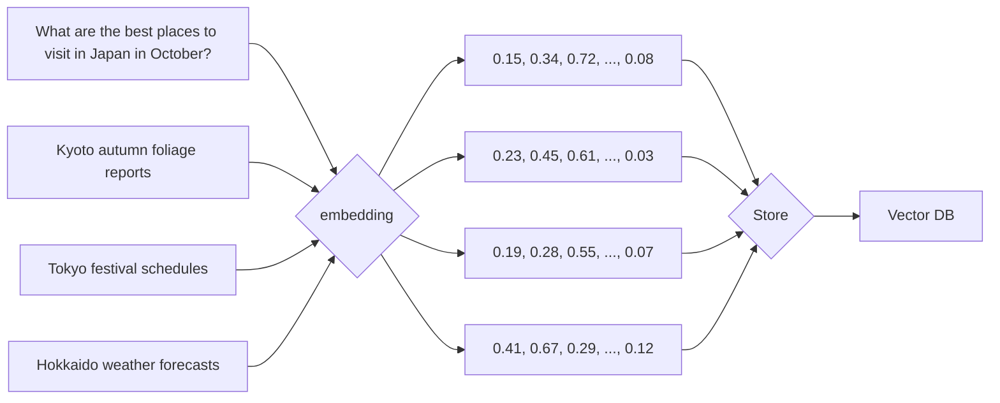
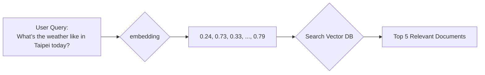
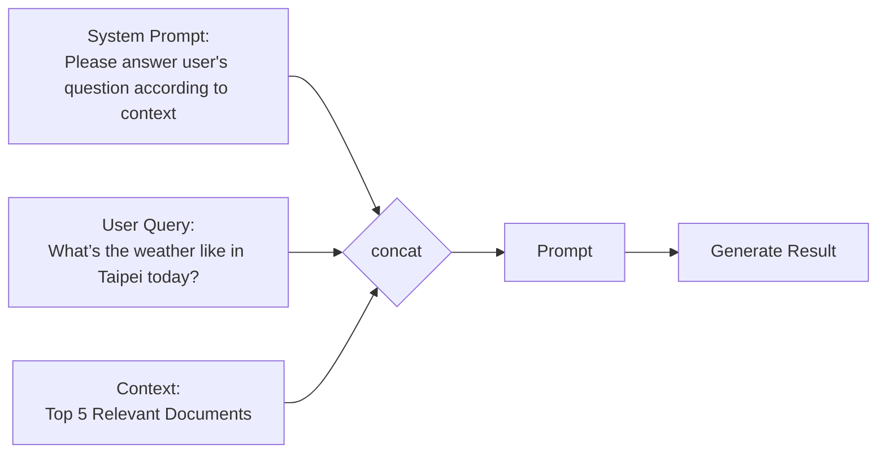

# Retrieval-Augmented Generation (RAG)
* Enables models to leverage external knowledge bases

## Why RAG
* Reduces reliance on **training data**
* Mitigates **hallucination** (where models generate incorrect or fabricated information)
* Enables models to leverage **external knowledge bases**, making them more effective for tasks like question answering, research, and domain-specific applications

## RAG Workflow Steps
1. Preprocessing
  * Collect data
  * Split data into `n` chunks
  * Convert the data into vector embeddings using embedding models
  * Store these embeddings in a vector database

2. User Query
  * Convert `user query` to an embedding
  * Search the vector database to find the top `n` most relevant documents based on similarity scores to the `user query`

3. Response
  * Retrieved relevant documents and combined them to original query
  * Generate result based on those information by LLM

